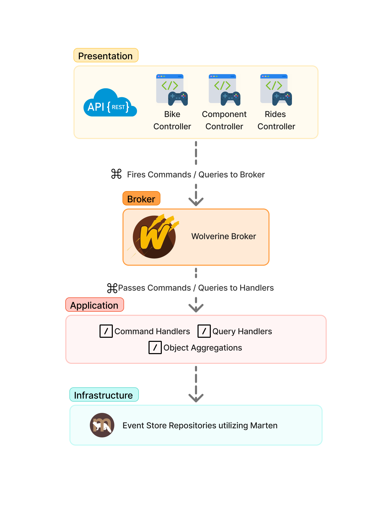

# Bike Wear Tracker  

Event Sourcing, CQRS & Clean Architecture

---

## Introduction & Motivation

- Modern systems need **reliability**, **auditability**, **evolvability**
- **Event Sourcing**: records all state changes as immutable events
- **Bike Wear Tracker**: helps cyclists monitor wear and maintenance

---

## Problem Statement

- Traditional CRUD systems struggle with:
  - **Auditability**: Hard to reconstruct history
  - **Evolvability**: Schema changes are risky
  - **Reliability**: Data loss/corruption is hard to detect
- Cyclists need to track:
  - Component usage (chain, tires, etc.)
  - Maintenance and replacements
  - Ride logs and mileage

---

## Solution Overview

- **Event Sourcing**: Every change is an event
- **CQRS**: Separate write (commands) and read (queries) models
- **Clean Architecture**: Clear separation of concerns
- **Tech Stack**:
  - .NET 9.0, Marten (PostgreSQL), Wolverine, REST API, Docker

---

## Architecture Diagram



---

## Key Features

- **Register Bikes**: Track multiple bikes per user
- **Add/Replace Components**: Full lifecycle tracking
- **Log Rides**: Updates mileage for bikes/components
- **Audit Trail**: Every change is an event
- **REST API**: For integration and automation

---

## Example Workflow

### Tracking Chain Wear

1. Register Bike  
2. Add Chain  
3. Log Rides  
4. Replace Chain

---

## Example Event Stream

```json
[
  { "eventType": "BikeRegisteredEvent", ... },
  { "eventType": "ComponentAddedEvent", ... },
  { "eventType": "RideLoggedEvent", ... },
  { "eventType": "ComponentReplacedEvent", ... }
]
```

---

## Benefits

- **Full Auditability**: Reconstruct any state at any time
- **Easy Evolution**: Add new events/commands safely
- **Reliability**: Immutable event log
- **Performance**: Optimized read models

---

## Deployment

- **Dockerized**: Consistent, easy setup
- **PostgreSQL**: Robust, scalable storage
- **OpenAPI**: Self-documenting REST API

---

## Conclusion

- **Bike Wear Tracker** shows event sourcing, CQRS, and Clean Architecture in practice
- Ideal for domains needing traceability and adaptability
- Practical reference for modern .NET event-driven apps